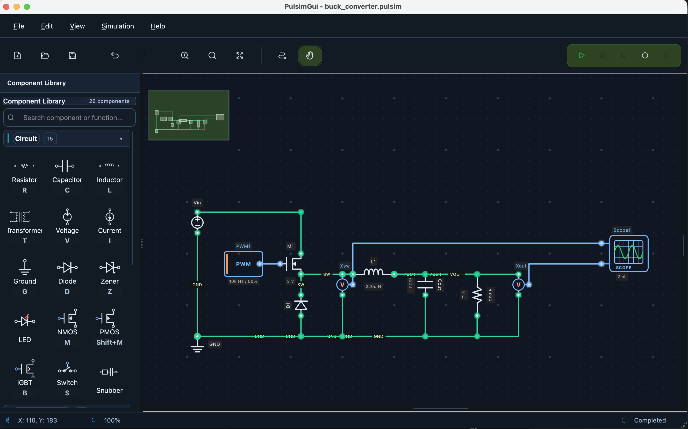

<div align="center">



# PulsimGui

**GUI profissional para simulação de eletrônica de potência com Pulsim.**

[](https://github.com/lgili/PulsimGUI/releases/latest)
[](https://lgili.github.io/PulsimGUI/)
[](LICENSE)
[](https://www.python.org/)

[**Baixar última release**](https://github.com/lgili/PulsimGUI/releases/latest) · [**Documentação**](https://lgili.github.io/PulsimGUI/) · [**Reportar bug**](https://github.com/lgili/PulsimGUI/issues)

</div>

---

O **PulsimGui** é uma interface gráfica cross-platform para o [Pulsim](https://github.com/lgili/PulsimCore), focada em modelagem e validação de conversores de potência.

## Principais recursos

- Editor esquemático com workflow drag-and-drop.
- Biblioteca de componentes para eletrônica de potência.
- Simulação transitória com controles avançados de solver.
- Waveform viewer com medições e inspeção de sinais.
- Exemplos prontos (`RC`, `buck`, `boost`, etc.) para validação rápida.

## Documentação oficial

A documentação completa está em:

- [https://lgili.github.io/PulsimGUI/](https://lgili.github.io/PulsimGUI/)

Conteúdo principal:

- Instalação e execução
- Guias da interface
- Configuração de simulação e backend
- Tutoriais com exemplos práticos
- Referência técnica para desenvolvimento

## Instalação

### 1. Release (recomendado)

Use os instaladores em [Releases](https://github.com/lgili/PulsimGUI/releases/latest).

### 2. Via pip

```bash
python3 -m pip install --upgrade pip
python3 -m pip install pulsimgui
```

Executar:

```bash
pulsimgui
```

### 3. Desenvolvimento (código-fonte)

```bash
git clone https://github.com/lgili/PulsimGUI.git
cd PulsimGui
python3 -m venv .venv
source .venv/bin/activate
python3 -m pip install --upgrade pip
python3 -m pip install -e ".[dev]"
python3 -m pulsimgui
```

## Backend recomendado

Para ambiente reprodutível, use **`pulsim v0.5.0`**.

Validação rápida:

```bash
python3 -c "import pulsim; print(pulsim.__version__)"
```

No app: `Preferences → Simulation → Backend Runtime`.

## Desenvolvimento

### Testes

```bash
pytest
```

### Lint

```bash
ruff check src tests
```

### Build local da documentação

```bash
python3 -m pip install -r docs/requirements.txt
mkdocs build --strict
mkdocs serve
```

## GitHub Pages (docs)

A documentação é publicada via workflow em:

- `.github/workflows/docs-pages.yml`

Deploy automático para GitHub Pages em `main` e `workflow_dispatch`.

> Configure no repositório: **Settings → Pages → Source: GitHub Actions**.

## Contribuição

- Abra issues para bugs e sugestões.
- Para PRs, inclua contexto, passos de validação e evidência (logs/capturas).
- Atualize docs quando houver mudança de fluxo/feature.

## Licença

MIT — veja [LICENSE](LICENSE).
