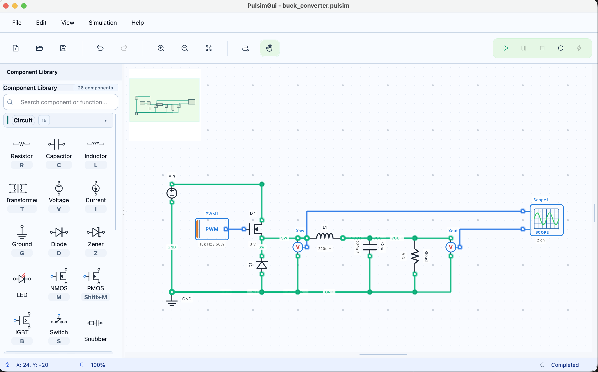

<div align="center">


# PulsimGui

**Professional power electronics simulation — beautifully simple.**

[](https://github.com/lgili/PulsimGui/releases/latest)
[](LICENSE)
[](https://www.python.org/)
[](https://github.com/lgili/PulsimGui/releases)

[**Download Latest Release**](https://github.com/lgili/PulsimGui/releases/latest) · [Documentation](https://lgili.github.io/PulsimGui) · [Report a Bug](https://github.com/lgili/PulsimGui/issues)

</div>

---

PulsimGui is a **cross-platform graphical interface** for the [Pulsim](https://github.com/lgili/PulsimCore) power electronics simulator. Design switching converter circuits visually, run transient simulations in seconds, and analyse waveforms in an interactive oscilloscope — all without writing a single line of netlist code.

## Screenshots

<table>
  <tr>
    <td align="center"><b>Dark</b></td>
    <td align="center"><b>Modern Dark</b></td>
    <td align="center"><b>Light</b></td>
  </tr>
  <tr>
    <td></td>
    <td></td>
    <td></td>
  </tr>
</table>

## Why PulsimGui?

- ⚡ **Native power electronics focus** — MOSFETs, IGBTs, diodes, buck/boost converters all first-class citizens
- 🎛️ **Schematic-first workflow** — drag-and-drop components, automatic node merging, instant netlist generation
- 📊 **Interactive waveform viewer** — multi-channel oscilloscope with cursor measurements and signal labels
- 🔁 **Unlimited undo/redo** — full command history for every schematic and parameter change
- 🎨 **Three built-in themes** — Dark, Modern Dark, and Light — switchable from Preferences
- 🖥️ **Truly cross-platform** — the same app runs on Windows, macOS, and Linux


## Features

| Category | Highlights |
|----------|------------|
| **Schematic Editor** | Drag-and-drop, component rotation, smart wire routing, multi-select |
| **Component Library** | MOSFETs, IGBTs, diodes, passive network elements, PWM generators, probes |
| **Simulation Engine** | Powered by PulsimCore — BDF1/TRBDF2 solver with adaptive Newton damping |
| **Waveform Viewer** | Multi-channel display, cursors, measurements, real-time streaming |
| **Analysis Modes** | Transient, DC operating point, parameter sweep |
| **Project System** | `.pulsim` files, auto-save, backup, example projects included |

---

## Download

### ⬇️ Pre-built installers (no Python required)

Go to the [**Releases page**](https://github.com/lgili/PulsimGui/releases/latest) and download the installer for your platform:

| Platform | File | Notes |
|----------|------|-------|
| **Windows** | `PulsimGui-*-windows-x64.zip` | Extract and run `PulsimGui.exe` |
| **macOS** | `PulsimGui-*-macos.dmg` | Open DMG, drag to Applications |
| **Linux** | `PulsimGui-*-linux-x86_64.tar.gz` | Extract and run `./PulsimGui` |

> **Note:** Standalone builds include all dependencies (Python, Qt, PulsimCore). Nothing else to install.

---

## Installation

### Option 1: Pre-built binary (Recommended for testers)

Download the latest installer from the [Releases page](https://github.com/lgili/PulsimGui/releases/latest) — no Python needed.

### Option 2: Install via pip

```bash
pip install pulsimgui
```

### Option 3: Install from source

```bash
# Clone the repository
git clone https://github.com/lgili/PulsimGui.git
cd PulsimGui

# Create virtual environment
python3 -m venv .venv
source .venv/bin/activate   # Windows: .venv\Scripts\activate

# Install in development mode
pip install -e ".[dev]"
```

### Option 4: Install directly from GitHub

```bash
pip install git+https://github.com/lgili/PulsimGui.git
```

---


## Running the Application

After installation, run PulsimGui with:

```bash
pulsimgui
```

Or as a Python module:

```bash
python -m pulsimgui
```

## Documentation Website

The project now includes a MkDocs Material site for user-facing documentation.

- GitHub Pages deploy runs automatically when pushing a version tag (`v*`).
- Local docs build:

```bash
python3 -m pip install -r docs/requirements.txt
mkdocs serve
```

Static build:

```bash
mkdocs build --strict
```

## Troubleshooting

### PySide6 Import Errors

If you get errors importing PySide6, ensure you have all Qt6 dependencies installed (see Prerequisites above).

**Linux specific**: If you see `libGL` or `libEGL` errors:
```bash
# Ubuntu/Debian
sudo apt install libgl1-mesa-glx libegl1-mesa

# Fedora
sudo dnf install mesa-libGL mesa-libEGL
```

### XCB Plugin Errors (Linux)

If you see `qt.qpa.plugin: Could not load the Qt platform plugin "xcb"`:
```bash
# Install missing xcb libraries
sudo apt install libxcb-xinerama0 libxcb-cursor0
```

### Display Issues on Linux

If running on a headless server or via SSH, set the display:
```bash
export QT_QPA_PLATFORM=offscreen  # For headless
# or
export DISPLAY=:0  # If X server is available
```

### Windows: Missing DLLs

If you get DLL errors on Windows, install the Visual C++ Redistributable:
- Download: https://aka.ms/vs/17/release/vc_redist.x64.exe

## Dependencies

All Python dependencies are declared in [`pyproject.toml`](pyproject.toml) and installed automatically by `pip`. The key runtime requirements are **Python ≥ 3.10**, **PySide6**, **pyqtgraph**, **numpy**, **qtawesome**, and **pulsim**.

## Development

### Running Tests

```bash
pytest
```

### Code Formatting

```bash
black src tests
ruff check src tests
```

### Building Standalone Executables

```bash
# Install build dependencies
pip install -e ".[build]"

# Build with PyInstaller
pyinstaller --name PulsimGui --windowed src/pulsimgui/__main__.py
```

### Project Structure

```
PulsimGui/
├── src/pulsimgui/
│   ├── models/          # Data models (Component, Wire, Circuit, Project)
│   ├── views/           # Qt widgets and UI components
│   ├── presenters/      # Business logic (MVP pattern)
│   ├── commands/        # Undo/redo command system
│   ├── services/        # Application services
│   └── utils/           # Utilities (SI prefix parsing, etc.)
├── tests/               # Unit tests
└── openspec/            # Specifications and requirements
```

## Contributing and Bug Reports

This is an early-access beta. Your feedback is invaluable! If something breaks:

1. Open an [issue on GitHub](https://github.com/lgili/PulsimGui/issues/new) with:
   - PulsimGui version (`Help → About`)
   - OS and Python version
   - Steps to reproduce + error message or screenshot
2. Attach your `.pulsim` project file when relevant

---

## License

MIT License — see [LICENSE](LICENSE) for details.

## Author

**Luiz Gili** — [luizcarlosgili@gmail.com](mailto:luizcarlosgili@gmail.com)

[GitHub](https://github.com/lgili) · [Issues](https://github.com/lgili/PulsimGui/issues) · [Releases](https://github.com/lgili/PulsimGui/releases)
