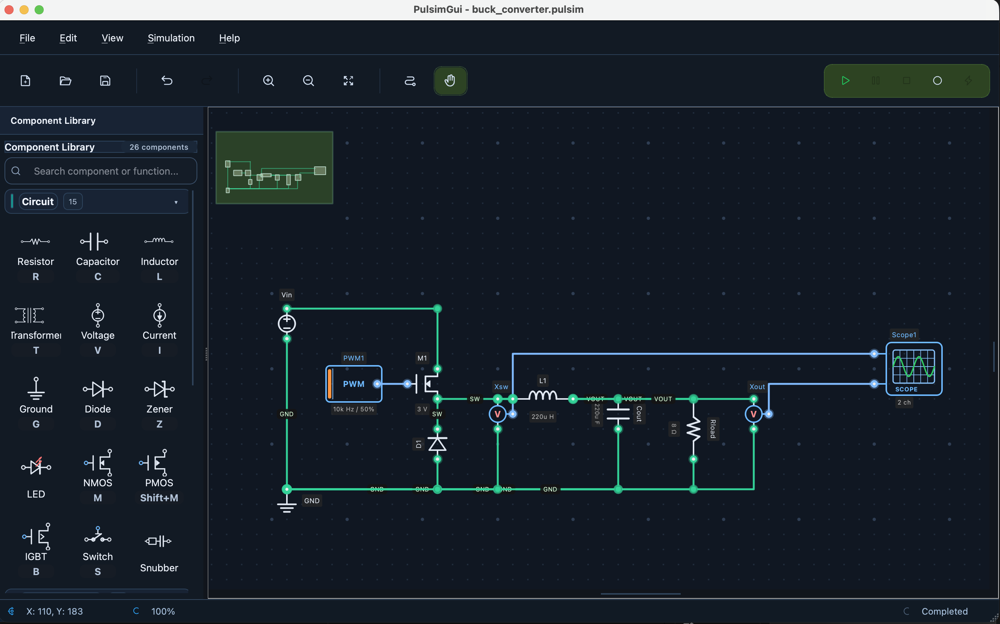
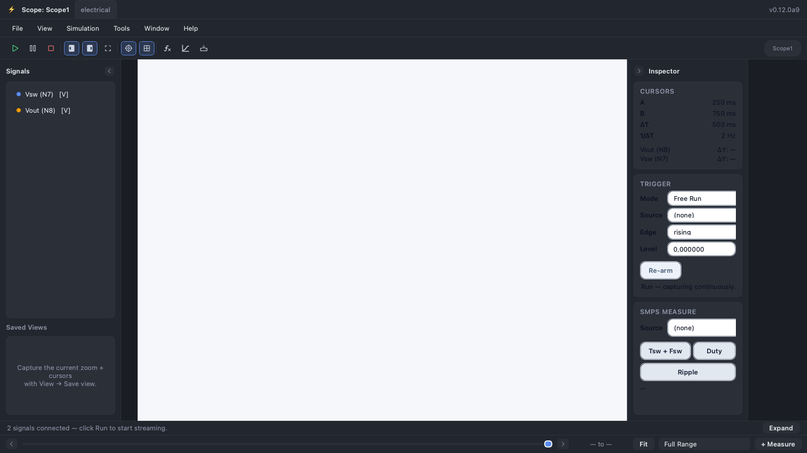

<div align="center">



# PulsimGui

**Professional GUI for power electronics simulation with Pulsim.**

[](https://github.com/lgili/PulsimGUI/releases/latest)
[](https://pypi.org/project/pulsimgui/)
[](https://lgili.github.io/PulsimGUI/)
[](LICENSE)
[](https://www.python.org/)

[**Download latest release**](https://github.com/lgili/PulsimGUI/releases/latest) · [**Install from PyPI**](https://pypi.org/project/pulsimgui/) · [**Documentation**](https://lgili.github.io/PulsimGUI/) · [**Report a bug**](https://github.com/lgili/PulsimGUI/issues)

</div>

---

**PulsimGui** is a cross-platform desktop interface for [Pulsim](https://github.com/lgili/PulsimCore), focused on modeling and validating power converter topologies.

## Key Features

- Schematic editor with drag-and-drop workflow.
- Component library focused on power electronics.
- Transient simulation with advanced solver controls.
- Advanced backend telemetry for convergence, fallback, and loss/thermal diagnostics.
- Integrated waveform viewer with signal measurements.
- Ready-to-run examples (`RC`, `buck`, `boost`, and more).

## PLECS-style Scope

Click any `Scope` component on the schematic to open a modular scope
window that streams data from `pulsim`'s `NativeLiveStream` during the
run and finalises the same window with the full-resolution result on
finish — no separate live / post-sim windows.

<div align="center">
  
</div>

Single shell + composable capabilities:

- **Live streaming** (60 Hz polling) — wired Run/Stop button on the toolbar.
- **Post-sim finalisation** — same curves, full-resolution arrays.
- **Cursors A/B** with ΔT, 1/ΔT (frequency), and per-signal ΔY readouts.
- **Math signals** — derived traces via a whitelisted formula
  (`A + B`, `abs(A)`, `derivative(A)`, `moving_avg(A, 16)`, …).
- **FFT view** — toggle the canvas to log-X magnitude (dB) of the
  cached signals.
- **Trigger** — Free Run / Single with edge + level on any source signal.
- **SMPS macros** — one-click Tsw / Fsw / Duty / Ripple on the visible
  window.
- **Export** — CSV (master time grid + linear interp per signal), PNG,
  or clipboard.

The shell adapts per scope variant: `ElectricalScopeVariant` (blue
accent, `V` default unit) and `ThermalScopeVariant` (orange accent,
`°C`). Adding a new variant is a one-file dataclass.

## Official Documentation

Full documentation is available at:

- [https://lgili.github.io/PulsimGUI/](https://lgili.github.io/PulsimGUI/)

Main content includes:

- Installation and execution
- GUI guides and workflow
- Simulation and backend configuration
- Practical tutorials
- Technical reference for contributors

## Installation

### 1. Release (Recommended)

Use installers from [Releases](https://github.com/lgili/PulsimGUI/releases/latest).

### 2. Install via pip

```bash
python3 -m pip install --upgrade pip
python3 -m pip install pulsimgui
```

Run:

```bash
pulsimgui
```

The `pulsimgui` package is published to PyPI by the release pipeline (`.github/workflows/release.yml`) whenever a new tag `v*` is released.

### 3. Development setup (source code)

```bash
git clone https://github.com/lgili/PulsimGUI.git
cd PulsimGui
python3 -m venv .venv
source .venv/bin/activate
python3 -m pip install --upgrade pip
python3 -m pip install -e ".[dev]"
python3 -m pulsimgui
```

## Recommended Backend

For reproducible behavior, use **`pulsim v0.7.9`**.

This is required for full advanced electrothermal support in GUI runtime:

- staged thermal networks (`single_rc`, `foster`, `cauer`)
- shared-sink coupling (`shared_sink_id`, `shared_sink_rth`, `shared_sink_cth`)
- datasheet switching-loss surfaces (`loss.model=datasheet`)

Quick check:

```bash
python3 -c "import pulsim; print(pulsim.__version__)"
```

In the app: `Preferences → Simulation → Backend Runtime`.

## Runtime Telemetry

With modern Pulsim backends, transient runs expose structured diagnostics in `SimulationResult.statistics`, including solver/backend telemetry and electrothermal summaries:

- `linear_solver_telemetry`
- `backend_telemetry`
- `fallback_trace`
- `loss_summary`
- `thermal_summary`
- `component_electrothermal`

## Development

### Tests

```bash
pytest
```

### Template Smoke Test (Pre-release)

```bash
PYTHONPATH=src python3 scripts/smoke_templates.py
```

### Lint

```bash
ruff check src tests
```

### Local docs build

```bash
python3 -m pip install -r docs/requirements.txt
mkdocs build --strict
mkdocs serve
```

## GitHub Pages (Docs)

Documentation is published through:

- `.github/workflows/docs-pages.yml`

Automatic deploy runs on `main` and `workflow_dispatch`.

> Repository setting required: **Settings → Pages → Source: GitHub Actions**.

## Contributing

- Open issues for bug reports and feature requests.
- For PRs, include context, validation steps, and evidence (logs/screenshots).
- Update docs whenever a user workflow or feature changes.

## License

MIT — see [LICENSE](LICENSE).
