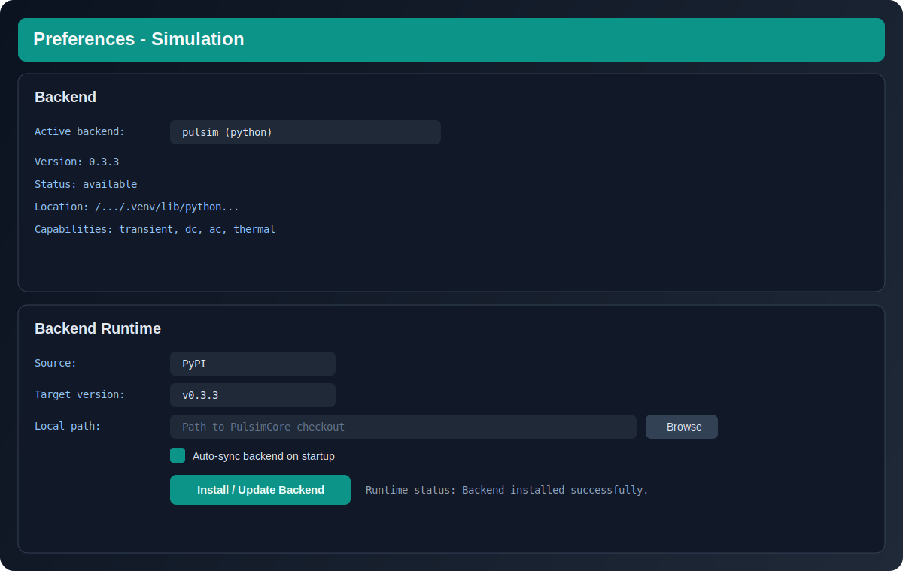

# Simulation Configuration

This page describes the actual parameters exposed in **Simulation Settings** and backend runtime configuration.

## Solver & Time

Core transient analysis parameters:

- `Integration method`:
  - `Auto (Backend default)`
  - `Trapezoidal`
  - `BDF1`, `BDF2`, `BDF3`, `BDF4`, `BDF5`
  - `Gear`, `TRBDF2`, `RosenbrockW`, `SDIRK2`
- `Step mode`: `Fixed step` or `Variable step`
- `Start time`
- `Step size`
- `Stop time`
- `Max step`
- `Relative tolerance`
- `Absolute tolerance`

## Events & Output

- `Enable simulation event detection`
- `Max step retries`
- `Output points`
- `Effective step` (calculated automatically)
- Duration presets: `1us` to `100ms`

## Advanced Section

### Transient Robustness

- `Max iterations` (Newton iterations per step)
- `Enable voltage limiting`
- `Max voltage step`
- `Enable robust transient retries`
- `Enable automatic regularization`

### DC Operating Point

- `Strategy`:
  - `Auto`
  - `Direct Newton`
  - `GMIN Stepping`
  - `Source Stepping`
  - `Pseudo-Transient`
- `GMIN initial` / `GMIN final` (when using `GMIN Stepping`)
- `Source steps` (when using `Source Stepping`)

## Backend Runtime (Preferences)

Path: `Preferences → Simulation`

- `Active backend`
- `Version`, `Status`, `Location`, `Capabilities`
- `Source`: `PyPI` or `Local`
- `Target version`
- `Local path`
- `Auto-sync backend on startup`
- `Install / Update Backend`

## Recommended Starter Profile

- Integration: `Auto`
- `Step mode`: `Fixed step`
- `Relative tolerance`: `1e-4`
- `Absolute tolerance`: `1e-6`
- `Output points`: `10000`
- Transient robustness: enabled
- Backend target: `v0.5.3`
