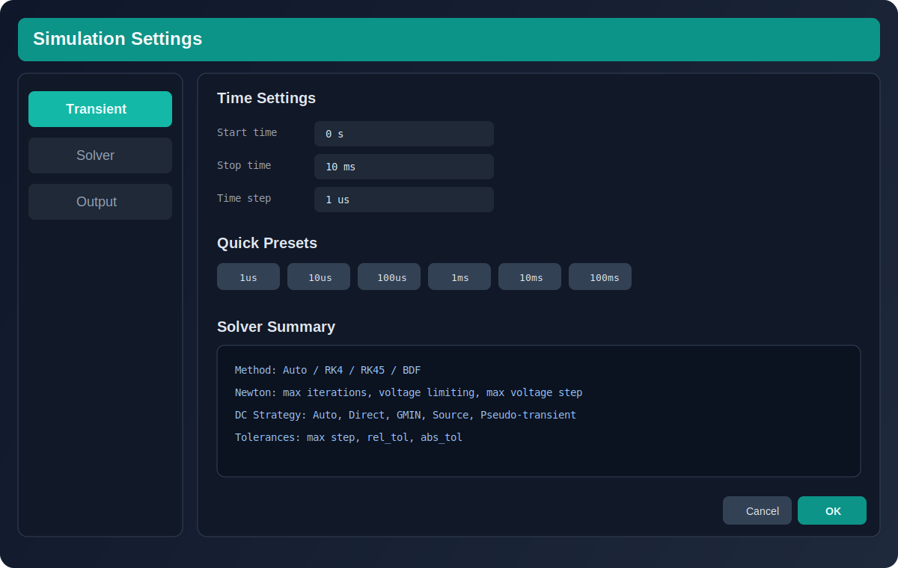
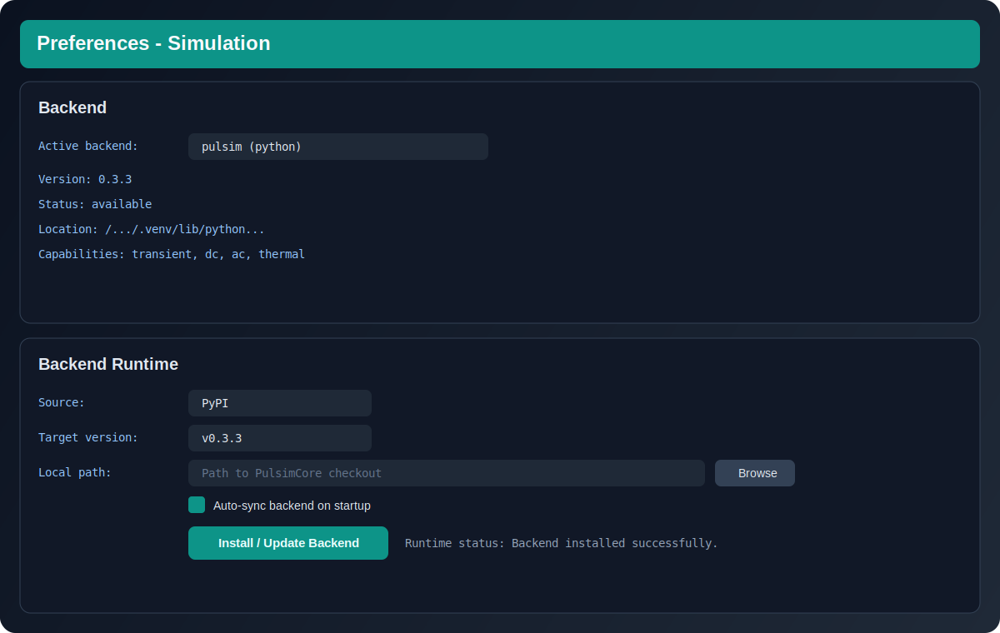

# Simulation Configuration

This page describes the actual parameters exposed in **Simulation Settings** and backend runtime configuration.

## Solver & Time

Core transient analysis parameters:

- `Integration method`:
  - `Auto (Backend default)`
  - `Trapezoidal`
  - `BDF1`, `BDF2`, `BDF3`, `BDF4`, `BDF5`
  - `Gear`, `TRBDF2`, `RosenbrockW`, `SDIRK2`
- `Step mode`: `Fixed step` or `Variable step`
- `Start time`
- `Step size`
- `Stop time`
- `Max step`
- `Relative tolerance`
- `Absolute tolerance`

## Events & Output

- `Enable simulation event detection`
- `Max step retries`
- `Output points`
- `Effective step` (calculated automatically)
- Duration presets: `1us` to `100ms`

## Advanced Section

### Transient Robustness

- `Max iterations` (Newton iterations per step)
- `Enable voltage limiting`
- `Max voltage step`
- `Enable robust transient retries`
- `Enable automatic regularization`

### DC Operating Point

- `Strategy`:
  - `Auto`
  - `Direct Newton`
  - `GMIN Stepping`
  - `Source Stepping`
  - `Pseudo-Transient`
- `GMIN initial` / `GMIN final` (when using `GMIN Stepping`)
- `Source steps` (when using `Source Stepping`)

### Formulation & Control

- `Formulation mode`:
  - `Projected wrapper`
  - `Direct DAE formulation`
- `Enable projected fallback when direct fails`
- `Control mode`:
  - `Auto`
  - `Continuous`
  - `Discrete`
- `Control sample time`:
  - Required (`> 0`) when `Control mode = Discrete`
  - Ignored for `Auto` and `Continuous`

### Thermal & Losses

- `Enable electrical loss tracking`
- `Ambient temperature`
- `Thermal network` (global solver helper):
  - `Foster`
  - `Cauer`
- `Include conduction losses`
- `Include switching losses`

These options feed backend runtime (`SimulationOptions`) and post-processing telemetry (`loss_summary`, `thermal_summary`, `component_electrothermal`).

### Component Thermal/Loss Parameters (Properties Panel)

For supported components (`resistor`, `diode`, `mosfet`, `igbt`, `bjt_npn`, `bjt_pnp`), Properties Panel exposes:

- thermal single RC:
  - `thermal_enabled`
  - `thermal_network=single_rc`
  - `thermal_rth`, `thermal_cth`
- thermal staged network:
  - `thermal_network=foster|cauer`
  - `thermal_rth_stages`, `thermal_cth_stages` (comma-separated)
- shared sink coupling:
  - `thermal_shared_sink_id`
  - `thermal_shared_sink_rth`, `thermal_shared_sink_cth`
- common thermal fields:
  - `thermal_temp_init`, `thermal_temp_ref`, `thermal_alpha`

Loss model options:

- scalar switching energies:
  - `switching_loss_model=scalar`
  - `switching_eon_j`, `switching_eoff_j`, `switching_err_j`
- datasheet surfaces:
  - `switching_loss_model=datasheet`
  - `switching_loss_axes_current|voltage|temperature` (comma-separated)
  - `switching_loss_eon_table|eoff_table|err_table` (row-major flatten)

The GUI pre-validates these contracts before backend execution and reports deterministic diagnostics (`PULSIM_YAML_E_*`) for invalid combinations.

## Backend Runtime (Preferences)

Path: `Preferences → Simulation`

- `Active backend`
- `Version`, `Status`, `Location`, `Capabilities`
- `Source`: `PyPI` or `Local`
- `Target version`
- `Local path`
- `Auto-sync backend on startup`
- `Install / Update Backend`

## Recommended Starter Profile

- Integration: `Auto`
- `Step mode`: `Fixed step`
- `Relative tolerance`: `1e-4`
- `Absolute tolerance`: `1e-6`
- `Output points`: `10000`
- Transient robustness: enabled
- Backend target: `v0.7.0`
