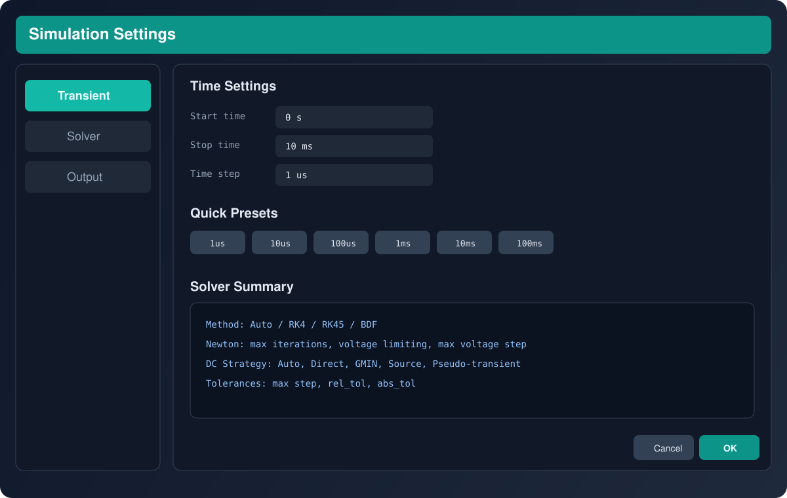
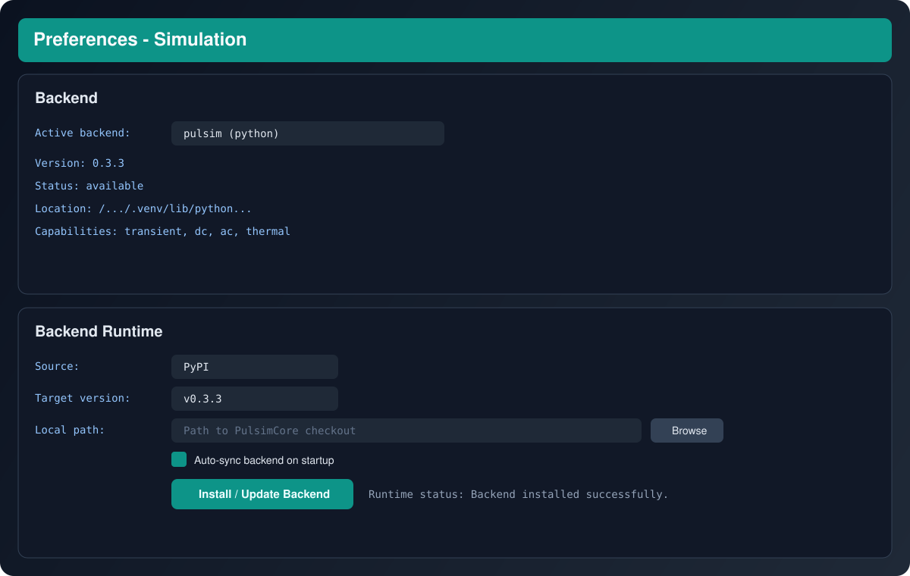

# Simulation Configuration

This page describes the actual parameters exposed in **Simulation Settings** and backend runtime configuration.

## Solver & Time

Core transient analysis parameters:

- `Integration method`:
  - `Auto (Backend default)`
  - `Trapezoidal`
  - `BDF1`, `BDF2`, `BDF3`, `BDF4`, `BDF5`
  - `Gear`, `TRBDF2`, `RosenbrockW`, `SDIRK2`
- `Step mode`: `Fixed step` or `Variable step`
- `Start time`
- `Step size`
- `Stop time`
- `Max step`
- `Relative tolerance`
- `Absolute tolerance`

## Events & Output

- `Enable simulation event detection`
- `Max step retries`
- `Output points`
- `Effective step` (calculated automatically)
- Duration presets: `1us` to `100ms`

## Advanced Section

### Transient Robustness

- `Max iterations` (Newton iterations per step)
- `Enable voltage limiting`
- `Max voltage step`
- `Enable robust transient retries`
- `Enable automatic regularization`

### DC Operating Point

- `Strategy`:
  - `Auto`
  - `Direct Newton`
  - `GMIN Stepping`
  - `Source Stepping`
  - `Pseudo-Transient`
- `GMIN initial` / `GMIN final` (when using `GMIN Stepping`)
- `Source steps` (when using `Source Stepping`)

### Formulation

- `Formulation mode`:
  - `Projected wrapper`
  - `Direct DAE formulation`
- `Enable projected fallback when direct fails`

### Control block sampling (`Ts`)

Global control scheduling is no longer configured in **Simulation Settings**.
Control scheduling is configured per control block in the **Properties Panel**:

- `Ts` (`sample_time`) = `0`: auto/continuous behavior.
- `Ts` (`sample_time`) > `0`: discrete update at that sampling period.
- Mixed-rate control is supported by setting different `Ts` values on different blocks.
- Scopes and probes do not expose `Ts`.

### Thermal & Losses

- `Enable electrical loss tracking`
- `Ambient temperature`
- `Thermal network` (global solver helper):
  - `Foster`
  - `Cauer`
- `Include conduction losses`
- `Include switching losses`

These options feed backend runtime (`SimulationOptions`) and post-processing telemetry (`loss_summary`, `thermal_summary`, `component_electrothermal`).

### Component Thermal/Loss Parameters (Properties Panel)

For supported components (`resistor`, `diode`, `mosfet`, `igbt`, `bjt_npn`, `bjt_pnp`), Properties Panel exposes:

- thermal single RC:
  - `thermal_enabled`
  - `thermal_network=single_rc`
  - `thermal_rth`, `thermal_cth`
- thermal staged network:
  - `thermal_network=foster|cauer`
  - `thermal_rth_stages`, `thermal_cth_stages` (comma-separated)
- shared sink coupling:
  - `thermal_shared_sink_id`
  - `thermal_shared_sink_rth`, `thermal_shared_sink_cth`
- common thermal fields:
  - `thermal_temp_init`, `thermal_temp_ref`, `thermal_alpha`

Loss model options:

- scalar switching energies:
  - `switching_loss_model=scalar`
  - `switching_eon_j`, `switching_eoff_j`, `switching_err_j`
- datasheet surfaces:
  - `switching_loss_model=datasheet`
  - `switching_loss_axes_current|voltage|temperature` (comma-separated)
  - `switching_loss_eon_table|eoff_table|err_table` (row-major flatten)

The GUI pre-validates these contracts before backend execution and reports deterministic diagnostics (`PULSIM_YAML_E_*`) for invalid combinations.

### Magnetic Core Parameters (Saturable Inductor)

Available when a **Sat. Inductor** component is selected.
Requires `pulsim ≥ v0.7.9` and `magnetic_core_enabled = True`.

**Core control:**

| Parameter | Type | Description |
| --- | --- | --- |
| `magnetic_core_enabled` | bool | Activates the nonlinear magnetic model. |
| `magnetic_core_model` | dropdown | `saturation` (smooth curve) or `hysteresis` (bounded state). |
| `magnetic_core_loss_policy` | dropdown | `telemetry_only` (virtual channel only) or `loss_summary` (also reports to loss/thermal tables). |

**Base saturation curve:**

| Parameter | Default | Description |
| --- | --- | --- |
| `saturation_current` | `10.0` A | Current at which inductance begins to saturate. |
| `saturation_inductance` | `1 µH` | Minimum inductance at deep saturation. |
| `saturation_exponent` | `2.0` | Sharpness of the saturation knee. |

**Core loss (Steinmetz-style):**

| Parameter | Default | Description |
| --- | --- | --- |
| `core_loss_k` | `0.0` | Loss coefficient *k* (W/unit). Set `0` to disable. |
| `core_loss_alpha` | `2.0` | Flux-density exponent α. |
| `core_loss_freq_coeff` | `0.0` | Frequency-dependent loss coefficient. |

**Initial condition:**

| Parameter | Default | Description |
| --- | --- | --- |
| `i_equiv_init` | `0.0` A | Initial equivalent magnetizing current. |

**Hysteresis model** (`magnetic_core_model = hysteresis` only):

| Parameter | Default | Description |
| --- | --- | --- |
| `hysteresis_band` | `0.0` | Half-width of the hysteresis band (A). |
| `hysteresis_strength` | `0.15` | Coupling strength of the hysteresis state (0–1). |
| `hysteresis_loss_coeff` | `0.2` | Energy dissipated per cycle coefficient. |
| `hysteresis_state_init` | `1.0` | Initial hysteresis state (−1 or 1). |

**Virtual channels produced by the backend:**

| Channel key | Unit | Condition |
| --- | --- | --- |
| `<component>.core_loss` | W | Always when `magnetic_core_enabled`. |
| `<component>.h_state` | — | Only when `magnetic_core_model = hysteresis`. |
| `T(<component>.core)` | °C | When `simulation.thermal.enabled = true`. |

!!! note "Symbol hint"
    The schematic symbol changes automatically: a **solid bar** indicates the `saturation`
    model; **two dashed bars** indicate `hysteresis`.

## Backend Runtime (Preferences)

Path: `Preferences → Simulation`

- `Active backend`
- `Version`, `Status`, `Location`, `Capabilities`
- `Source`: `PyPI` or `Local`
- `Target version`
- `Local path`
- `Auto-sync backend on startup`
- `Install / Update Backend`

## Recommended Starter Profile

- Integration: `Auto`
- `Step mode`: `Fixed step`
- `Relative tolerance`: `1e-4`
- `Absolute tolerance`: `1e-6`
- `Output points`: `10000`
- Transient robustness: enabled
- Backend target: `v0.7.9`
