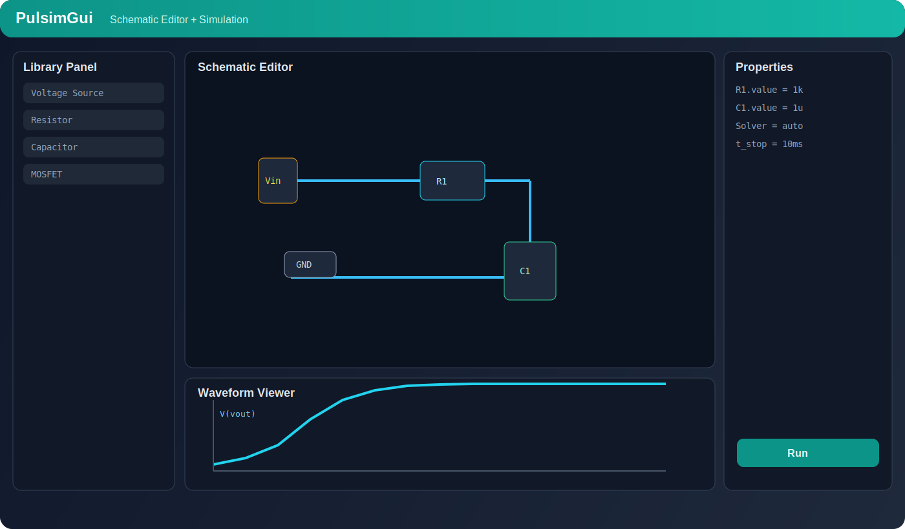
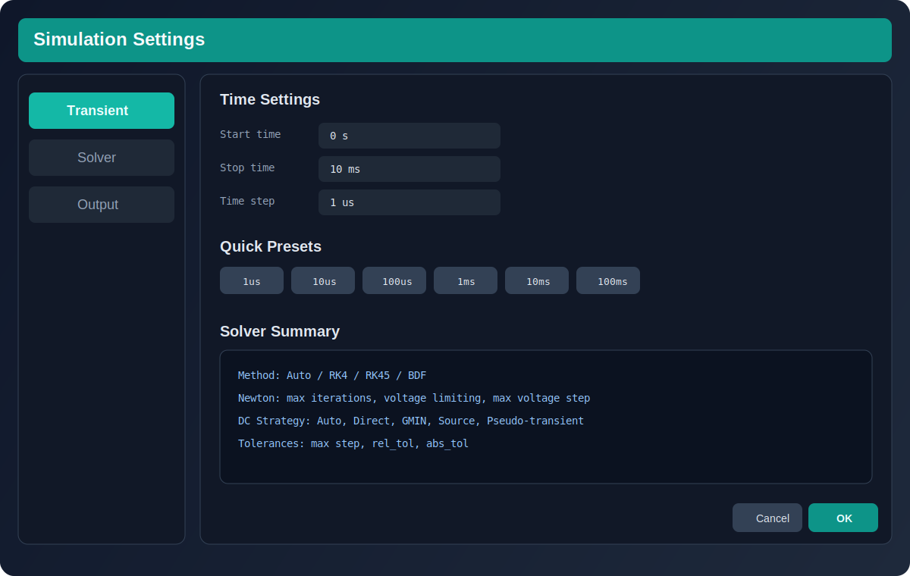

# Visão Geral da GUI

Esta página mostra os blocos principais da interface para você navegar rápido no app.

## Áreas principais

1. **Library Panel**: componentes elétricos para arrastar ao esquema.
2. **Schematic Editor**: área de desenho do circuito.
3. **Properties Panel**: edição de parâmetros do item selecionado.
4. **Waveform Viewer**: visualização de sinais da simulação.
5. **Status Bar**: estado da simulação e mensagens.

## Fluxo de trabalho típico

1. Inserir componentes pela biblioteca.
2. Conectar os nós com fios.
3. Ajustar parâmetros no painel de propriedades.
4. Abrir configurações de simulação.
5. Executar e conferir as formas de onda.

## Telas de configuração

Você vai usar principalmente duas janelas:

- **Simulation Settings**: tempos, solver, tolerâncias e saída.
- **Preferences > Simulation**: backend ativo, runtime, versão alvo e defaults.

