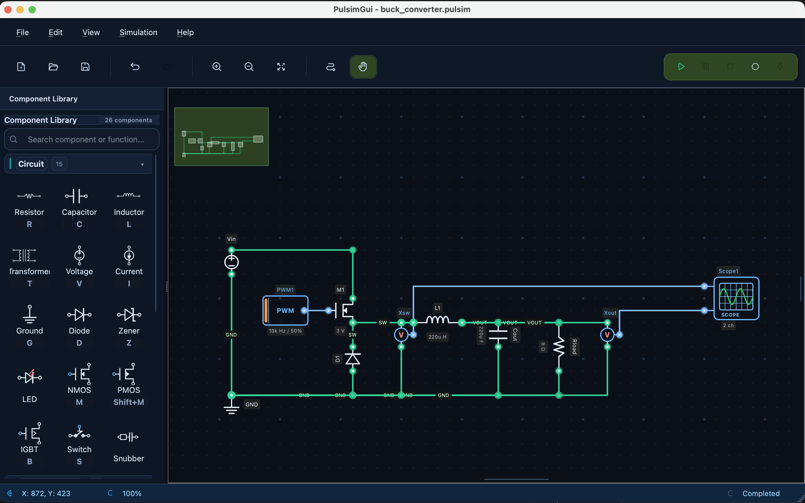

# PulsimGui

Desktop GUI for modeling and simulating power converter circuits with the **Pulsim** backend.

## What You Can Do

- Build schematics using power electronics components.
- Run transient simulations with full solver configuration.
- Inspect waveforms in real time with the integrated viewer.
- Validate topologies using ready-to-run examples (RC, buck, boost, and more).

## Recommended Workflow

1. Install and launch the app in [Installation and Run](instalacao.md).
2. Complete the first tutorial in [First RC Circuit](tutoriais/circuito-rc.md).
3. Move to [Buck Converter Example](tutoriais/conversor-buck.md).
4. Tune solver and tolerance settings in [Simulation Configuration](gui/configuracao-simulacao.md).

## Default Project Backend

The recommended runtime baseline is **`pulsim v0.5.3`**.

!!! tip "Reproducible environment"
    In `Preferences → Simulation`, keep `Source = PyPI`, `Target version = v0.5.3`, and `Auto-sync` enabled to maintain consistency across machines.

## Useful Links

- Repository: [github.com/lgili/PulsimGUI](https://github.com/lgili/PulsimGUI)
- Releases: [github.com/lgili/PulsimGUI/releases](https://github.com/lgili/PulsimGUI/releases)
- PyPI: [pypi.org/project/pulsimgui](https://pypi.org/project/pulsimgui/)
- Issues: [github.com/lgili/PulsimGUI/issues](https://github.com/lgili/PulsimGUI/issues)
