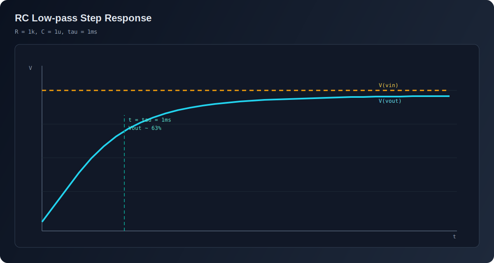

# Primeiro Circuito RC

Tutorial rápido para validar instalação, conectividade do esquema e fluxo de simulação.

## Objetivo

Montar um passa-baixa RC simples e confirmar a curva exponencial em `Vout`.

## Topologia

- `Vin` (fonte)
- `R1 = 1kΩ`
- `C1 = 1uF`
- `GND`

Conexões:

1. `Vin+ -> R1`
2. `R1 -> Vout`
3. `Vout -> C1`
4. `C1 -> GND`
5. `Vin- -> GND`

## Passo a passo na GUI

1. Crie um projeto novo.
2. Insira `Voltage Source`, `Resistor`, `Capacitor` e `Ground`.
3. Faça as conexões da topologia acima.
4. Ajuste os parâmetros de `R1` e `C1`.
5. Configure a fonte como degrau ou pulso.
6. Abra `Simulation Settings` e use:
   - `Start time = 0`
   - `Stop time = 10ms`
   - `Step size = 1us`
   - `Output points = 10000`
7. Clique em **Run**.
8. No viewer, plote `V(vout)` e `V(vin)`.

## Resultado esperado

- `V(vout)` cresce exponencialmente.
- `τ = R × C = 1k × 1u = 1ms`.
- Em ~`5τ` (aprox. `5ms`), a saída fica próxima do valor final.

## Checklist de validação

- Simulação finaliza sem erro.
- `V(vout)` tem curva de 1ª ordem coerente.
- Alterar `R` ou `C` desloca `τ` como esperado.
